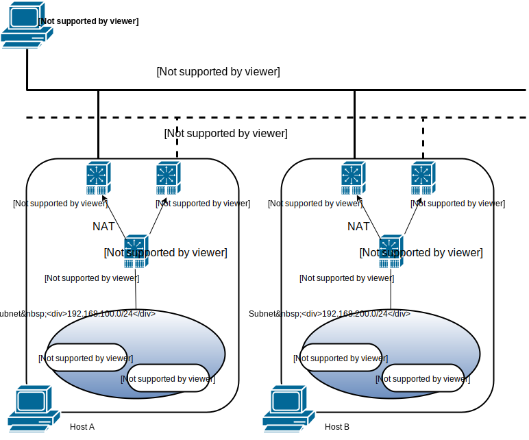
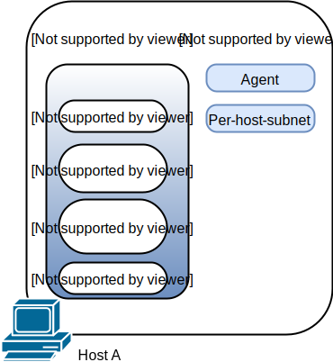

# Rancher on Windows

---
## Host Requirement
Windows Server 2016 Datacenter with Container

## Network

### Summary
Only support per-host-subnet network module.

The extra route rule for each subnet will be needed on each host. e.g. The route rules:

|Hostname|Route Rule|
|---|---|
|Host A|`route add 192.168.200.0 mask 255.255.255.0 172.16.0.3`|
|Host B|`route add 192.168.100.0 mask 255.255.255.0 172.16.0.2`|

There are three kinds of network driver support by docker for windows server.

* nat
* transparent
* none

We don't have any container network like host or container becuase shared network namespace is not supported in windows. So we can not modify the host network in the container. All the network setting needs to be done by rancher agent and network services run in the host.

All the container we start in rancher will use this network as default.

### Agent
The agent needs to do following things.

1. Register agent service in windows.[**done**]
2. Register rancher network service according to our network model choice. For now, we only support per-host-subnet. But more network models will be supported in the future.
3. Add a start-up powershell script to add rancher labels into the host environment variable. The environment key is `CATTLE_HOST_LABELS`. Those labels is set in the adding host page.

### The per-host-subnet

The per-host-subnet service needs to create the subnet according to rancher host label, deal with the route rules of this host and set port mapping for containers.

Here are the details of each work. 

* Enable the l3 routing. The service needs to start the `RemoteAccess` service. And Set the item `IPEnableRouter` of `hklm:\system\currentcontrolset\services\tcpip\parameters` to 1.The `RemoteAccess` service is disable by default. It needs to be set to automatic.
* Chech the firewall rule and make sure that network communication between hosts is ok. Here is the command to turn off the firewall for now: `netsh advfirewall set allprofile state off`
* Load the subnet from the rancher host label(configured in host environment variable): `io.rancher.network.per_host_subnet.subnet`.[**WIP**]
  1. Create a private network interface with powershell script.
  2. Create a transparent network with docker API. The command we use in CLI is `docker network create -d transparent --subnet <subnet> --gateway <gateway_ip> -o com.docker.network.windowsshim.interface="<Interface_name_from_step_1> transparent"`. The subnet is from the label. The gateway ip is generated by the service. Normally the gateway ip is the first ip of the subnet.
  3. Configure the gateway ip to the interface that create by the transparent network. Use following command `netsh interface ipv4 set address "<transparent_network_interface_name>" static <gateway_ip> <net mask>`.
* Configure the route rules for metadata/DNS service. The service can use either `IP Helper`(iphlpapi.dll) from Windows API or `netsh` to set the route rules. Following command is for metadata service: `netsh interface ipv4 add route 169.254.169.250/32 "<transparent_network_interface_name>" <gateway_ip>`
* Configure the route rules for other subnets. The service will watch the metadata and change the route rules for the Host. Following command is an example rules with `netsh`: `netsh interface ipv4 add route <host_B_subnet_CIDR> "<outer_network_interface_name>" <host_B_outer_IP>`
* Port mapping will be support by `netsh` portproxy module in transparent network. The service will watch the metadata change and configure the port mapping rules for the container.

## Windows Environment

There are some differences between Linux environment and windows environment. In Windows environment, only windows host will be supported.

Micro-service on container list

* network-service: metadata and DNS services
* scheduler
* healthcheck: haproxy for windows(**NEED_TEST**)
* load balancer: metadata watcher and haproxy for windows(**NEED_TEST**)

All the service will use the transparent network.

## Micro-service

### Network-service

The metadata service in rancher needs to serve in 169.254.169.250:80. So the service will add this IP address to its network interface.

In linux environment, The DNS service will share the network with metadata so all the DNS nameserver in Rancher will point to 169.254.169.250:53. In Windows environment, network namespace cannot be shared between containers. So we decide to set the dns service address to 169.254.169.251:53. Same as metadata service, it will add this IP address to its network interface.

The metadata service and DNS service need to be rebuilt base on `microsoft/nanoserver`.

### Scheduler

Scheduler is a single go program depends on metadata. So I think it only needs to be rebuilt base on `microsoft/nanoserver`.

### Healthcheck(Not PoC yet)

Need more degin

### Load Balancer service(Not PoC yet)

Need more degin