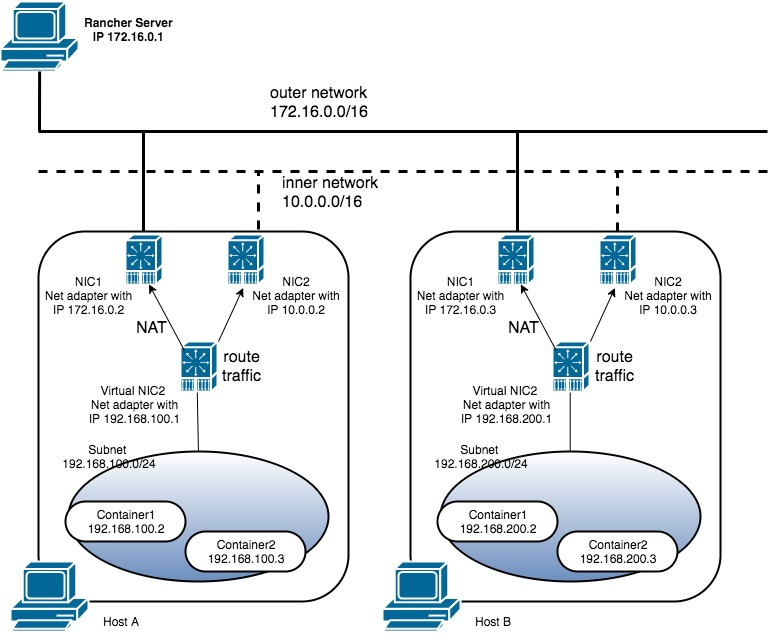

# Rancher on Windows

---
## Goal
As we support windows container in Rancher v1.3, only experiential, our goal is always **what Docker can do, Rancher can do**. In Rancher, we always talk about Rancher microservice, load balancer, catalog and overlay network. So in long term, our goal is to have same experiment on Windows and Linux. Followings are what we need to implement on Windows.

* Microservice
	* Network-service
	* Health check service(Not mature)
	* Scheduler service
* Overlay network
	* The per-host-subnet
	* Other overlay network model is not supported because of the limitation of Docker on Windows
* Catalog service
	* The template can be deployed in Windows environment
	* The users can know about the difference of template content between on Windows container and Linux container
* Load balancer
	* Use HAProxy as the load balancer(Not mature)

* Enhancement:
	* Adding labels on the Windows host when Adding host.
	* Specify the public ip of the windows host.
	* Download all the executable resource from the rancher server.
	* Windows service support for Rancher agent.

## Limitation of Docker on Windows

* There are three kinds of network driver support by docker for windows server.
	* nat
	* transparent
	* none
* For now, the shared network namespace is not supported in Windows. So the overlay network service can not run in container. The service, like per-host-subnet service, needs to run as a windows host service.
* Because the docker nat network is supported by WinNAT and the port mapping is supported by WinNAT. But in per-host-subnet, we use transparent with a local virtual subnet. So we are using `portproxy` function of `netsh` for port mapping. 
* In per-host-subnet, the containers can talk to each other by route rules, but can not talk out side of the cluster. Because there is not any NAT when the network traffic going out.
* Linux host can not be added into windows environment because the network and micro-service is not compatible with Linux environment.

## Detail of work

Micro-service
---

### Network-service 

The metadata service in rancher needs to serve in 169.254.169.250:80. So the service will add this IP address to its network interface.

In Linux environment, The DNS service will share the network with metadata so all the DNS nameserver in Rancher will point to 169.254.169.250:53. In Windows environment, network namespace cannot be shared between containers. So we decide to set the DNS service address to 169.254.169.251:53. Same as metadata service, it will add this IP address to its network interface.

The metadata service and DNS service need to be rebuilt base on `microsoft/nanoserver`.

### Scheduler

The scheduler is a single go program depends on metadata. So I think it only needs to be rebuilt base on `microsoft/nanoserver`. It also need to add a CI support for Windows powershell.

### Healthcheck(Not PoC yet)

Need more design

### Load Balancer service(Not PoC yet)

Need more design

Overlay Network
---

### The per-host-subnet

The per-host-subnet service needs to create the subnet according to rancher host label, deal with the route rules of this host and set port mapping for containers.

Here is the per-host-subnet model:

The extra route rule for each subnet will be needed on each host. e.g. The route rules:

|Hostname|Route Rule|
|---|---|
|Host A|`route add 192.168.200.0 mask 255.255.255.0 172.16.0.3`|
|Host B|`route add 192.168.100.0 mask 255.255.255.0 172.16.0.2`|

Here are the technical details for network route:

* Enable the l3 routing. The service needs to start the `RemoteAccess` service. And Set the item `IPEnableRouter` of `HKLM:\system\currentcontrolset\services\tcpip\parameters` to 1. The `RemoteAccess` service is disabled by default. It needs to be set to automatic.
* Check the firewall rule and make sure that network communication between hosts is ok. Here is the command to turn off the firewall for now: `netsh advfirewall set allprofile state off`.
* Load the subnet from the rancher host label(configured in host environment variable): `io.rancher.network.per_host_subnet.subnet`.
  1. Create a private network interface with a Powershell script command.
  2. Create a transparent network with docker API. The command we use in CLI is `docker network create -d transparent --subnet <subnet> --gateway <gateway_IP> -o com.docker.network.windowsshim.interface="<Interface_name_from_step_1> transparent"`. The subnet is from the label. The gateway IP is generated by the service. Normally the gateway IP is the first IP of the subnet.
  3. Configure the gateway IP to the interface created by the transparent network. Use following command `netsh interface IPv4 set address "<transparent_network_interface_name>" static <gateway_IP> <net mask>`.
* Configure the route rules for metadata/DNS service. The service can use either `IP Helper`(iphlpapi.dll) from Windows API or `netsh` to set the route rules. Following command is for metadata service: `netsh interface IPv4 add route 169.254.169.250/32 "<transparent_network_interface_name>" <gateway_IP>`.
* Configure the route rules for other subnets. The service will watch the metadata and change the route rules for the Host. Following command is an example rules with `netsh`: `netsh interface ipv4 add route <host_B_subnet_CIDR> "<outer_network_interface_name>" <host_B_outer_IP>`.

Here is the technical details for port mapping:

* Port mapping will be supported by `netsh` portproxy module in the transparent network. The service will watch the metadata change and configure the port mapping rules for the container.

Catalog service
---

### Demo catalog on Windows host

Create a demo template for windows. Using IIS server and mysql database. To show user how a catalog entry can be created and deployed in Windows environment.

Load balancer
---
Need more design and research.

Enhancement
---
### Adding Host Labels & Specify the Public IP of Windows Host
We need to support adding labels and specifying the public IP for adding the host in the Windows environment. We need to have a start-up Powershell script to do it.

### Download all the executable resource from the rancher server.
Because we need to run network service in the host instead of running in the container, we need to download and start the per-host-subnet program and register it into windows service.

It is a better way that we can download all those resources(start-up script, agent and per-host-subnet) from the rancher server. So we need to package all the resources into rancher server container and have a link to download them.

### Windows service support for Rancher agent
Because we run the rancher agent as a Windows host service, we need to register it into Windows service.
Because the per-host-subnet service will create a container network first, the Rancher agent service should start after the network has been created. So we need to setup the dependence of each services.

